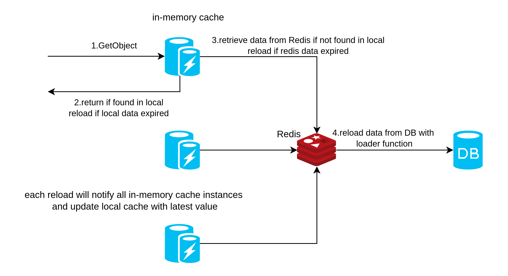

# cache
A lightweight and high-performance distributed caching, a cache-aside pattern implementation built on top of in-memory + Redis. The cache consists of one global Redis instance and multiple in-memory instances, with any data changes being synchronized across all instances.

The library is designed to prioritize retrieving data from the in-memory cache first, followed by the Redis cache if the data is not found locally. If the data is still not found in either cache, the library will call a loader function to retrieve the data and store it in the cache for future access.

One of the key benefits of this library is its performance. By leveraging both in-memory and Redis caches, the library can quickly retrieve frequently accessed data without having to rely solely on network calls to Redis. Additionally, the use of a loader function allows for on-demand retrieval of data, reducing the need for expensive data preloading.



## Features
- **Two-level cache** : in-memory cache first, redis-backed
- **Easy to use** : simple api with minimum configuration.
- **Data consistency** : all in-memory instances will be notified by `Pub-Sub` if any value gets updated, redis and in-memory will keep consistent.
- **Concurrency**: singleflight is used to avoid cache breakdown.
- **Metrics** : provide callback function to measure the cache metrics.

## Sequence diagram
### Reload from loader function
```mermaid
sequenceDiagram
    participant APP as Application
    participant M as cache
    participant L as Local Cache
    participant L2 as Local Cache2
    participant S as Shared Cache
    participant R as LoadFunc(DB)
    
    APP ->> M: Cache.GetObject()
    alt reload
        M ->> R: LoadFunc
        R -->> M: return from LoadFunc
        M -->> APP: return
        M ->> S: redis.Set()
        M ->> L: notifyAll()
        M ->> L2: notifyAll()
    end
```

### Cache GetObject
```mermaid
sequenceDiagram
    participant APP as Application
    participant M as cache
    participant L as Local Cache
    participant L2 as Local Cache2
    participant S as Shared Cache
    participant R as LoadFunc(DB)
    
    APP ->> M: Cache.GetObject()
    alt Local Cache hit
        M ->> L: mem.Get()
        L -->> M: {interface{}, error}
        M -->> APP: return
        M -->> R: async reload if expired
    else Local Cache miss but Shared Cache hit
        M ->> L: mem.Get()
        L -->> M: cache miss
        M ->> S: redis.Get()
        S -->> M: {interface{}, error}
        M -->> APP: return
        M -->> R: async reload if expired
    else All miss
        M ->> L: mem.Get()
        L -->> M: cache miss
        M ->> S: redis.Get()
        S -->> M: cache miss
        M ->> R: sync reload
        R -->> M: return from reload
        M -->> APP: return
    end
```

### Set
```mermaid
sequenceDiagram
    participant APP as Application
    participant M as cache
    participant L as Local Cache
    participant L2 as Local Cache2
    participant S as Shared Cache
    
    APP ->> M: Cache.SetObject()
    alt Set
        M ->> S: redis.Set()
        M ->> L: notifyAll()
        M ->> L2: notifyAll()
        M -->> APP: return
    end
```

### Delete
```mermaid
sequenceDiagram
    participant APP as Application
    participant M as cache
    participant L as Local Cache
    participant L2 as Local Cache2
    participant S as Shared Cache
    
    APP ->> M: Cache.Delete()
    alt Delete
        M ->> S: redis.Delete()
        M ->> L: notifyAll()
        M ->> L2: notifyAll()
        M -->> APP: return
    end
```

### Installation

`go get -u github.com/seaguest/cache`

### API
```go
type Cache interface {
    SetObject(ctx context.Context, key string, obj interface{}, ttl time.Duration) error
    GetObject(ctx context.Context, key string, obj interface{}, ttl time.Duration, f func() (interface{}, error)) error
    Delete(key string) error
    Disable()
}
```

### Tips

```github.com/seaguest/deepcopy```is adopted for deepcopy, returned value is deepcopied to avoid dirty data.
please implement DeepCopy interface if you encounter deepcopy performance trouble.

```go
func (p *TestStruct) DeepCopy() interface{} {
	c := *p
	return &c
}
```

### Usage

``` go
package main

import (
	"context"
	"fmt"
	"log"
	"time"

	"github.com/gomodule/redigo/redis"
	"github.com/seaguest/cache"
)

type TestStruct struct {
	Name string
}

// this will be called by deepcopy to improves reflect copy performance
func (p *TestStruct) DeepCopy() interface{} {
	c := *p
	return &c
}

func getStruct(ctx context.Context, id uint32, cache cache.Cache) (*TestStruct, error) {
	var v TestStruct
	err := cache.GetObject(ctx, fmt.Sprintf("TestStruct:%d", id), &v, time.Second*3, func() (interface{}, error) {
		// data fetch logic to be done here
		time.Sleep(time.Millisecond * 1200 * 1)
		return &TestStruct{Name: "test"}, nil
	})
	if err != nil {
		fmt.Printf("%+v", err)
		return nil, err
	}
	return &v, nil
}

func main() {
	pool := &redis.Pool{
		MaxIdle:     1000,
		MaxActive:   1000,
		Wait:        true,
		IdleTimeout: 240 * time.Second,
		TestOnBorrow: func(c redis.Conn, t time.Time) error {
			_, err := c.Do("PING")
			return err
		},
		Dial: func() (redis.Conn, error) {
			return redis.Dial("tcp", "127.0.0.1:6379")
		},
	}

	supercache := cache.New(
		cache.GetConn(pool.Get),
		cache.OnMetric(func(key string, metric cache.MetricType, elapsedTime int) {
			log.Println("x---------", metric, "-", key, "-", elapsedTime)
		}),
		cache.OnError(func(err error) {
			log.Printf("%+v", err)
		}),
	)

	ctx, cancel := context.WithTimeout(context.Background(), time.Second*2)
	defer cancel()
	v, e := getStruct(ctx, 100, supercache)
	log.Println(v, e)
}
```

### JetBrains

Goland is an excellent IDE, thank JetBrains for their free Open Source licenses.
